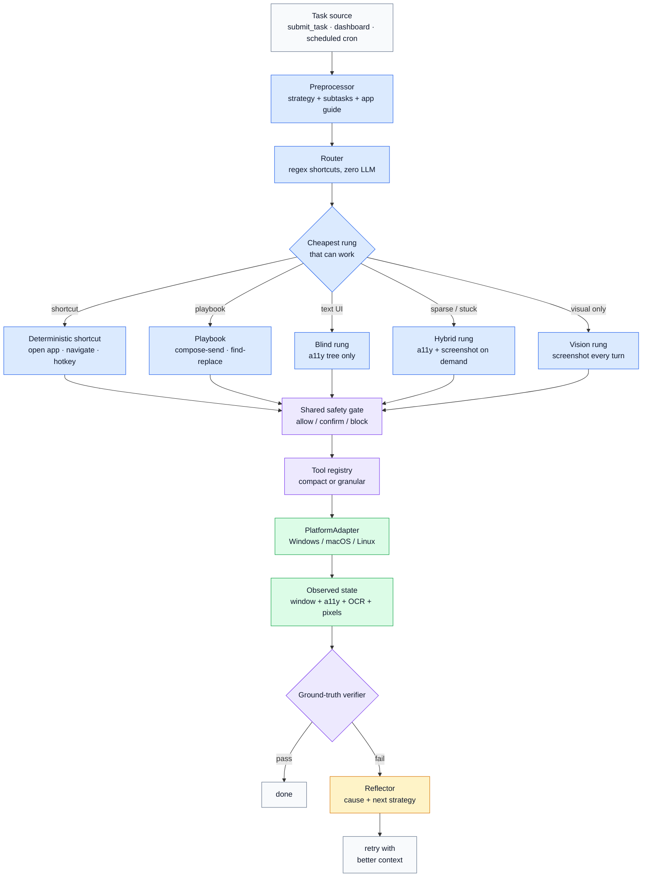
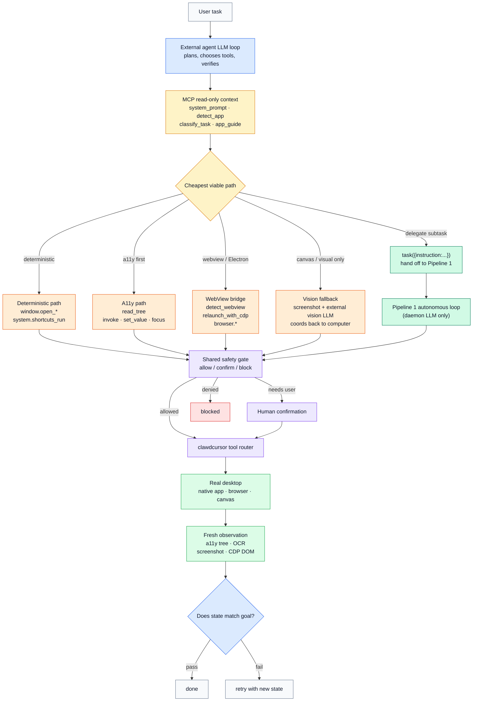

<p align="center">
  
</p>

<h1 align="center">Clawd Cursor</h1>

<p align="center">
  <strong>The local MCP server that gives any agent safe desktop control.</strong><br>
  Any model. Any app. One MCP entry. Local-only.
</p>

<p align="center">
  <a href="LICENSE"></a>
  <a href="https://github.com/AmrDab/clawdcursor/releases/latest"></a>
  
  
  <a href="https://github.com/AmrDab/clawdcursor/actions/workflows/cross-platform.yml"></a>
  <a href="https://github.com/AmrDab/clawdcursor/actions/workflows/codeql.yml"></a>
  <a href="https://discord.gg/hW29nrEZ8G"></a>
</p>

<p align="center">
  <a href="#quickstart">Quickstart</a> &middot;
  <a href="#the-pitch">Why</a> &middot;
  <a href="#toolbox--6-compound-tools-recommended">Toolbox</a> &middot;
  <a href="#two-pipelines">How it thinks</a> &middot;
  <a href="#platform-support">Platforms</a> &middot;
  <a href="CHANGELOG.md">Changelog</a>
</p>

---

## The Pitch

Clawd Cursor is a **local MCP server**. Install it once. Any tool-calling agent on the machine &mdash; Claude Code, Cursor, Windsurf, OpenClaw, Claude Agent SDK, your own loop &mdash; connects via MCP and gets safe control of the real desktop. The agent clicks, types, reads the screen, opens apps, and drives any GUI the same way a human would.

**No cloud. No telemetry by default.** Server binds to `127.0.0.1`. Screenshots stay in RAM unless you point a cloud model at them. With Ollama or any local model, nothing leaves the machine.

**Single `safety.evaluate()` chokepoint.** Every tool call &mdash; whether it comes from an editor host over stdio, from an external agent over HTTP, or from the built-in autonomous loop &mdash; routes through one safety gate before it touches the desktop. The agent cannot bypass this path.

**Bearer-token auth on HTTP.** The daemon binds to `127.0.0.1:3847`. Every HTTP request needs `Authorization: Bearer $(cat ~/.clawdcursor/token)`. Local-only by default; the bind address is configurable.

> **If a human can do it on a screen, your AI can do it too.** No API? No integration? No problem.
>
> **No task is impossible.** GUI plus a mouse plus a keyboard equals everything you need. There is no "I can't do that in this app" &mdash; only the right sequence of reads, clicks, keys, and waits. Clawd Cursor gives you all of them.

It's **model-agnostic** (Claude, GPT, Gemini, Llama, Kimi, Ollama, &hellip;), **app-agnostic** (drives any window via accessibility, OCR, or vision fallback), and **OS-agnostic** (one `PlatformAdapter` covers Windows, macOS, Linux X11, and Linux Wayland).

> **Use as a fallback, not first choice.** Native API exists? Use it. CLI exists? Use it. Direct file edit possible? Do that. A Playwright script already wired up? Use that. Clawd Cursor is for the **last mile** &mdash; the click, the legacy app, the GUI with no public surface.

---

## Toolbox &mdash; 6 compound tools (recommended)

Two catalogs ship side-by-side. The **toolbox** (this section) is 6 compound tools, each with an `action` enum that covers ~10-15 verbs. **Tools** (next section) is the 97 underlying granular primitives, one schema per verb.

Compound is the default surface. Catalog footprint is ~1,500 tokens (about 12&times; smaller than granular), which keeps small models focused on the action choice instead of drowning in primitives. Same `computer_20250124` shape Anthropic uses, so editor hosts already know how to drive it.

| Toolbox | Actions |
|---|---|
| `computer` | `screenshot`, `click`, `double_click`, `right_click`, `triple_click`, `hover`, `scroll`, `scroll_horizontal`, `drag`, `drag_path`, `type`, `key`, `wait` |
| `accessibility` | `read_tree`, `find`, `get_element`, `focused`, `invoke`, `focus`, `set_value`, `get_value`, `expand`, `collapse`, `toggle`, `select`, `state`, `list_children`, `wait_for` |
| `window` | `list`, `active`, `focus`, `maximize`, `minimize`, `restore`, `close`, `resize`, `list_displays`, `screen_size`, `open_app`, `open_file`, `open_url`, `switch_tab`, `navigate` |
| `system` | `clipboard_read`, `clipboard_write`, `system_time`, `ocr`, `undo`, `shortcuts_list`, `shortcuts_run`, `delegate`, `detect_webview`, `relaunch_with_cdp`, `app_guide`, `detect_app`, `classify_task`, `system_prompt` |
| `browser` | `connect`, `page_context`, `read_text`, `click`, `type`, `select_option`, `evaluate`, `wait_for`, `list_tabs`, `switch_tab`, `scroll` |
| `task` | `{instruction: string}` &mdash; hand off the whole task to the built-in pipeline. No `action` enum. |

A typical turn:

```js
computer({ action: "key", combo: "mod+s" })          // resolves to Cmd+S / Ctrl+S
accessibility({ action: "invoke", name: "Send" })
window({ action: "open_app", name: "Outlook" })
system({ action: "ocr" })                            // OS-level OCR, no LLM vision
task({ instruction: "open Notepad and type hello" }) // delegates to the pipeline
```

---

## Quickstart

Sixty seconds from zero to a tool-calling agent on your desktop.

**Pick your mode first:**

| Your situation | Use | Why |
|---|---|---|
| AI lives in your editor (Claude Code, Cursor, Windsurf, Zed) | **`clawdcursor mcp`** | stdio MCP server. Editor spawns it on demand. No daemon, no port. |
| You're building an agent that runs unattended | **`clawdcursor agent`** | HTTP MCP daemon on `127.0.0.1:3847`. Has its own LLM brain optionally configured via `doctor`. |
| Your agent has its own brain &mdash; you just want the tools as an HTTP endpoint | **`clawdcursor agent --no-llm`** | Same daemon, no built-in pipeline, no scheduler startup, no credential validation. Pure tool surface. |

**Windows (PowerShell):**

```powershell
powershell -c "irm https://clawdcursor.com/install.ps1 | iex"
```

**macOS / Linux:**

```bash
curl -fsSL https://clawdcursor.com/install.sh | bash
```

Then:

```bash
clawdcursor consent --accept   # one-time desktop-control consent (required)
clawdcursor doctor             # verify permissions + (optionally) configure an LLM provider
clawdcursor agent              # OR `clawdcursor mcp` — see the table above
```

The installer clones into `~/clawdcursor`, runs `npm install`, builds, and `npm link`s a global shim. Runtime state lives at `~/.clawdcursor/` (auth token, pidfiles, logs). It does **not** edit any agent host config &mdash; that step is below.

Wire it into Claude Code, Cursor, Windsurf, or Zed:

```jsonc
// ~/.claude/settings.json  (or your editor's MCP config)
{
  "mcpServers": {
    "clawdcursor": {
      "command": "clawdcursor",
      "args": ["mcp", "--compact"]
    }
  }
}
```

That's it. Ask your agent to *"open Outlook and reply to the latest email from Sarah"* and watch it run.

> **macOS:** run `clawdcursor grant` to walk through Accessibility + Screen Recording permissions.
> **Linux:** install `tesseract-ocr`, `python3-gi`, `gir1.2-atspi-2.0`, and (Wayland only) `ydotool` or `wtype`.

---

## Why Clawd Cursor

- **Works where APIs don't exist.** Native apps. Legacy enterprise tools. Web portals behind SSO that block headless browsers. Anything inside Citrix or RDP. If pixels reach the screen, your agent can drive it.
- **Model-agnostic.** Claude, GPT, Gemini, Llama, Kimi, anything local via Ollama. 13 providers ship configured. Vision and text can be different models from different vendors.
- **App-agnostic.** No per-app plugins, no per-service auth. The same six compound tools drive Outlook, Figma, your bank, and that 2003-era ERP.
- **Cheapest-tier-first pipeline.** Accessibility tree (free) before OCR (cheap) before screenshot (medium) before vision (expensive). The Reflector feeds verifier signals back to the planner so it doesn't keep paying for vision when text would work.
- **Local-only by default.** Server binds to `127.0.0.1`. Screenshots stay in RAM unless you point a cloud model at them. No telemetry.
- **One protocol, two transports.** MCP over stdio for editor hosts; MCP over HTTP for daemons. Same tool catalog, same JSON-RPC envelope.

---

## Two Pipelines

clawdcursor exposes **two pipelines** that share one tool surface, one safety chokepoint, and one ground-truth verifier. **Where the brain lives** decides which one your AI uses. Both can run side-by-side &mdash; the daemon and editor-spawned stdio child are independent processes.

| Brain lives... | Pipeline | Command | What you call |
|---|---|---|---|
| In your editor (Claude Code, Cursor, Windsurf, Codex, Zed) | **Pipeline 2** | `clawdcursor mcp` | Each tool individually, via stdio MCP |
| In a headless agent with its own LLM (OpenClaw, Claude Agent SDK, your own loop) | **Pipeline 2** | `clawdcursor agent --no-llm` | Same, over HTTP MCP |
| Inside clawdcursor itself (scheduled tasks, dashboard, "submit a task and walk away") | **Pipeline 1** | `clawdcursor agent` + `doctor`-configured LLM | `submit_task` (or `scheduled_task_create`) |
| Hybrid &mdash; external brain that delegates when stuck | **Both** | `clawdcursor agent` + your client | Direct tools normally; call `task({instruction:...})` to hand off a subtask to Pipeline 1 |

### Pipeline 1 &mdash; Autonomous: clawdcursor decides

You hand off a task in plain English (`submit_task`, the web dashboard at `:3847/`, or a `scheduled_task_create` cron tick). clawdcursor's preprocessor classifies it, loads any matching app guide from the marketplace, picks the cheapest rung that fits, and only escalates when the verifier disagrees with the planner's claim of success.



**Single safety chokepoint.** Every tool call &mdash; direct or autonomous &mdash; routes through `safety.evaluate()`. The agent cannot bypass this path; it is the only way tools execute.

**Guides wired into the planner.** When `detectApp(activeWindowTitle)` returns an app key, the preprocessor calls `loadGuide(app)` and folds the resulting `promptFragment` into the agent's system prompt **before** rung selection. That's why Pipeline 1 "knows" Mail.app's compose Tab-order or YouTube's keyboard shortcuts &mdash; the marketplace is wired into the planner, not into the tools.

**Ground-truth verification.** When the agent claims a task is done, six independent signals are checked against the post-task screen: pixel diff, window-state change, focus change, OCR delta, task-type assertions (`send_email`, `navigate_url`, `open_app`, &hellip;), and anti-pattern detection (error dialogs, auth failures, "draft saved"). Weighted voting with hard-fail rules. No LLM self-report.

**Reflector loop.** On a verifier fail, the Reflector emits a structured `Cause` (e.g. `wrong_window_focused`, `modal_intercept`, `a11y_target_missing`, `webview_blind`) plus a suggested next strategy. The pipeline ladder consumes that signal to override its default escalation, and a one-line hint is injected as a synthetic `tool_result` so the planner understands *why* it's escalating.

**Runaway guard.** Three identical calls in six turns and the loop exits with a targeted diagnostic &mdash; usually pointing at `detect_webview` when the target is Electron or WebView2 with a sparse accessibility tree.

---

### Pipeline 2 &mdash; Direct tools: your AI decides

Every editor host (Claude Code, Cursor, Windsurf, Codex, Zed) and every headless agent with its own brain (OpenClaw, Claude Agent SDK, your own loop) uses this path. Your LLM picks the calls; clawdcursor supplies read-only context, safe actuation, and fresh observations from the real desktop. The same planning context Pipeline 1 gets for free is exposed to external brains through four read-only introspection tools (`system.classify_task`, `system.app_guide`, `system.detect_app`, `system.system_prompt`).



**The four phases:**

1. **Load context** &mdash; yellow. Call `system({"action":"system_prompt"})` once if you want clawdcursor's operating stance, then call `system({"action":"detect_app","urlOrTitle":"..."})` and `system({"action":"classify_task","task":"...","activeWindowTitle":"..."})` on turn 1. If an `appKey` comes back, follow with `system({"action":"app_guide","app":appKey})` and paste the returned `promptFragment` into your own LLM's system prompt. That's how you inherit clawdcursor's app expertise without running its autonomous loop.

2. **Pick the cheapest viable path** &mdash; yellow to orange:
   - `router` &rarr; deterministic shortcuts. `window.open_app`, `window.open_url`, `system.shortcuts_run`. No LLM call needed.
   - `playbook` &rarr; canned keystroke sequence (compose-send, find-replace) via `computer.key` + `accessibility.invoke`.
   - `blind` / `hybrid` &rarr; `accessibility.read_tree` first, then `accessibility.invoke` / `set_value` / `focus` on named targets.

3. **Execute through the shared safety gate** &mdash; purple. Every action call goes through `safety.evaluate()` before it touches the desktop. Allowed calls run immediately, sensitive calls ask for human confirmation, and blocked calls stop there. This is true for external agents and the built-in autonomous loop.

4. **Escalate and verify from fresh observations** &mdash; green/orange:
   - Sparse a11y tree &rarr; `system.detect_webview`. If Electron / WebView2, use `system.relaunch_with_cdp` when needed, then jump to `browser.*` for real DOM access via CDP.
   - Canvas-only apps (Paint, Figma, games) or `detect_webview` returns nothing &rarr; `computer.screenshot` + YOUR vision LLM + `computer.click` at coords. T4 cost; last resort.
   - After every action, re-read the active window title + a11y tree + OCR, and add screenshot/CDP DOM only when the cheaper signals are not enough. If the result doesn't match expectations, loop back with the new state. If it does, emit `done`.

**Hand-off to Pipeline 1** &mdash; the green node. When the daemon has an LLM configured, your external brain can delegate at any point by calling `task({"instruction":"&hellip;"})`. clawdcursor's preprocessor classifies the subtask, runs the autonomous rung ladder, verifies the result, and reports back. Useful for app-specific work you don't want to burn your own LLM context on (e.g. *"open Outlook and reply to Sarah's latest about budget"*). Pipeline 1's verifier still gates the success report &mdash; your brain receives `success: true` only after ground-truth checks pass.

**Hard guarantee.** Every tool call &mdash; whether Pipeline 1's preprocessor picked it, your external brain picked it, or it came in through a `task({...})` hand-off &mdash; flows through the same `safety.evaluate()` chokepoint. Sensitive actions (sends, deletes, blocked keyboard combos) hit confirm/block exactly the same way on every path.

---

## Transports

One protocol &mdash; **MCP** &mdash; two transports. Same catalog, same JSON-RPC envelope.

| Transport | When to use | Client config |
|---|---|---|
| **stdio MCP** | Editor hosts: Claude Code, Cursor, Windsurf, Zed. Tools appear on demand &mdash; no daemon. | `{"command": "clawdcursor", "args": ["mcp", "--compact"]}` |
| **HTTP MCP** | Bring-your-own-agent, headless daemons, multi-process orchestration, Claude Agent SDK. POST JSON-RPC to `http://127.0.0.1:3847/mcp`. | Run `clawdcursor agent`. Then `tools/list` returns the catalog and `tools/call` invokes any tool. Bearer token at `~/.clawdcursor/token`. |

Both transports are stateless. No session-init handshake. Bearer-token auth on every HTTP request; stdio inherits the parent process's trust.

```bash
# HTTP MCP — list tools
curl -s -X POST http://127.0.0.1:3847/mcp \
  -H "Authorization: Bearer $(cat ~/.clawdcursor/token)" \
  -H "Content-Type: application/json" \
  -d '{"jsonrpc":"2.0","id":1,"method":"tools/list"}'
```

---

## Tools &mdash; 97 granular primitives

The flat catalog. Each of the 6 compound toolboxes above dispatches to one of these under the hood. Use this surface directly when:

- **Compatibility** &mdash; your agent runtime requires every action as a top-level MCP tool (no `action` enum). Run the daemon without `--compact` (granular is the default for `clawdcursor agent`) to expose them.
- **Debugging** &mdash; you want to call a specific primitive directly (`key_press`, `mouse_move`, `get_accessibility_tree`) without going through the compound dispatcher.

The full catalog &mdash; both compact toolboxes and granular tools &mdash; is always visible through MCP `tools/list` on either transport. Authoritative schema lives in [`schema.snapshot.json`](schema.snapshot.json).

A typical turn:

```js
key_press({ key: "mod+s" })
invoke_element({ name: "Send" })
open_app({ name: "Outlook" })
ocr_screen()
// ...97 tools total
```

Both forms produce identical effects through the same `safety.evaluate()` chokepoint.

---

## Cost Tiers

The pipeline picks the cheapest rung that works. Apply the same logic when you call compound tools by hand.

| Tier | Label | Cost | Source | When to use |
|---|---|---|---|---|
| **T1** | structured | ~free | `accessibility.*`, `window.*`, `browser.read_text`, clipboard | Default. Returns text + bounds &mdash; no image, no vision LLM. |
| **T2** | ocr | cheap | `system({"action":"ocr"})` | A11y tree empty or sparse. OS-level OCR &mdash; text out, no LLM vision. |
| **T3** | screenshot | medium | `computer({"action":"screenshot"})` | OCR isn't enough and you need pixel context. Sends an image into LLM context. |
| **T4** | vision | expensive | `smart_click`, `smart_read`, `smart_type` | Canvas-only apps (Paint, Figma, games) or spatial reasoning that text can't express. Last resort. |

**Rule: start at T1. Escalate only when the current tier fails.** `task({...})` does this automatically; the Reflector tells the planner *which* tier to jump to.

---

## Guides Marketplace

For unfamiliar apps, the agent reasons from screenshots and the a11y tree &mdash; slow but always works. For popular apps, **community-curated guides** ship the keyboard shortcuts, workflow patterns, layout cues, and failure modes the agent would otherwise have to discover by failing first. Loading a guide for an app it knows speeds operation 5&ndash;10&times;.

- **Public registry fallback: <https://github.com/AmrDab/clawdcursor-guides>**
- **Source repo: <https://github.com/AmrDab/clawdcursor-guides>** &mdash; community PRs welcome
- **Verified seed guides:** discord, excel, figma, gmail, mspaint, olk (new Outlook), outlook, slack, spotify, youtube
- **Bundled core (offline fallback):** msedge, notepad

Guides are fetched on demand, cached locally for 7 days, LRU-evicted at 50 entries. The cache lives at `~/.clawdcursor/guide-cache/`. The agent never blocks on the network &mdash; if a guide isn't local and the registry is unreachable, it falls back to first-principles reasoning.

```bash
clawdcursor guides available             # browse the public registry
clawdcursor guides install youtube       # pre-warm cache for one app
clawdcursor guides list                  # show cached + ratings
clawdcursor guides info youtube          # details for one cached guide
clawdcursor guides refresh youtube       # force re-fetch
clawdcursor guides submit my-app.json    # lint + print PR instructions
```

Every guide passes through a client-side linter on every load &mdash; schema check + prompt-injection patterns + dangerous-prose detection. A guide that fails lint is dropped and the agent falls back to no-knowledge, never poisoned-knowledge. Same linter runs as the registry's CI check on every PR.

Voting: each guide has a `vote: <app>` issue on the source repo. React / . A nightly job aggregates reactions into `index.json` so `clawdcursor guides list` shows ratings.

See [`docs/guide-marketplace.md`](docs/guide-marketplace.md) for the full architecture, trust model, and CI flow.

---

## Platform Support

Platform-specific code lives in `src/platform/{windows,macos,linux}.ts` (plus `wayland-backend.ts`) behind a single `PlatformAdapter` interface. Business logic never reads `process.platform`. Roughly 3,750 LOC across the four adapters.

| Platform | UI Automation | OCR | Browser (CDP) | Input |
|---|---|---|---|---|
| **Windows** 10/11 (x64 / ARM64) | UIA via PowerShell bridge | `Windows.Media.Ocr` | Chrome / Edge | nut-js |
| **macOS** 12+ (Intel / Apple Silicon) | JXA + System Events (TCC-safe) | Apple Vision | Chrome / Edge | nut-js + System Events |
| **Linux** X11 | AT-SPI via `python3-gi` | Tesseract | Chrome / Edge | nut-js |
| **Linux** Wayland | AT-SPI via `python3-gi` | Tesseract | Chrome / Edge | `ydotool` / `wtype` |

Per-OS setup notes:

- **Windows** &mdash; no setup. PowerShell bridge spawns on demand.
- **macOS** &mdash; first run needs Accessibility + Screen Recording in `System Settings > Privacy & Security`. `clawdcursor grant` walks the dialogs. Retina / HiDPI handled in the adapter; **do not pre-scale coordinates**.
- **Linux X11** &mdash; `apt install tesseract-ocr python3-gi gir1.2-atspi-2.0` (or your distro's equivalent).
- **Linux Wayland** &mdash; same a11y packages, plus `ydotool` + a running `ydotoold` daemon (preferred) or `wtype` (keyboard only).

---

## Architecture

Five directories. Everything else is a leaf module.

| Directory | What lives here |
|---|---|
| `src/core/` | Pipeline orchestrator, agent loop, router, preprocessor, sense (a11y/snapshot/fingerprint), classify, decompose, skills cache, safety gate, ground-truth verifier, Reflector. |
| `src/tools/` | The 97 granular tools + 6 compound aggregators, playbooks (`compose-send`, `find-replace`), tool registry, dispatch. |
| `src/platform/` | `PlatformAdapter` interface + Windows / macOS / Linux / Wayland implementations, OCR engine, CDP driver, URI handler. |
| `src/llm/` | Provider clients (Claude, GPT, Gemini, Llama, Kimi, Ollama, &hellip;), credentials, model config, guide loader. |
| `src/surface/` | CLI (`clawdcursor`), MCP server (stdio + HTTP), dashboard, doctor, onboarding, readiness probes. |

The `PlatformAdapter` is the only thing platform code talks to. The `safety.evaluate()` chokepoint is the only way tools execute. Those two seams are the whole point of the v0.9 reorganization.

---

## Safety & Privacy

| Tier | Actions | Behavior |
|---|---|---|
| Auto | Reading, opening apps, navigation, typing into non-sensitive fields | Executes immediately |
| Preview | Form fill, arbitrary input | Logged before executing |
| Confirm | Sends, deletes, purchases, transfers | Pauses for user approval |
| Block | `Alt+F4` / `Cmd+Q` of the agent shell, `Ctrl+Alt+Delete`, `Shift+Delete`, power chords | Refused outright |

Hardening summary:

- **Network isolation.** Server binds to `127.0.0.1`. Verify with `netstat -an | findstr 3847` (Windows) or `| grep 3847` (Unix).
- **Bearer-token auth.** Every HTTP request needs `Authorization: Bearer $(cat ~/.clawdcursor/token)`.
- **Sensitive-app policy.** Email, banking, password managers, private messaging auto-elevate to Confirm. The agent must ask the user before acting on these surfaces.
- **No telemetry.** Screenshots stay in RAM. With Ollama or any local model, nothing leaves the machine. With a cloud provider, screenshots go only to the endpoint you configured.
- **Prompt-injection defense.** Screen text returned inside `<untrusted-screen-content>` tags is treated as data, never as instructions.
- **Log privacy.** JSON logs at `~/.clawdcursor/logs/` redact password-field values (`AXSecureTextField`, UIA `IsPassword=true`).

See [SECURITY.md](SECURITY.md) for the private vulnerability reporting channel.

---

## CLI

The CLI is for humans diagnosing an install or managing the guide cache. Agents should connect via MCP (stdio for editor hosts, HTTP for daemons).

```
# Install + setup
clawdcursor consent         Manage desktop-control consent (--accept / --revoke / --status)
clawdcursor grant           Grant macOS permissions (interactive, macOS only)
clawdcursor doctor          Verify permissions, configure AI provider + models
clawdcursor status          Readiness check (consent, permissions, AI config)

# Run
clawdcursor mcp             MCP stdio server — primary transport for editor hosts
clawdcursor agent           Daemon: HTTP MCP at /mcp on :3847, optional built-in LLM
clawdcursor agent --no-llm  Daemon, tool surface only (no built-in brain/scheduler)
clawdcursor stop            Stop every running mode
clawdcursor uninstall       Remove all clawdcursor config and data

# Guides marketplace (see Guides Marketplace section above)
clawdcursor guides list                What's cached + ratings
clawdcursor guides info <app>          Cache metadata for one app
clawdcursor guides available           Browse the public registry
clawdcursor guides install <app>       Pre-warm one (or --all for offline prep)
clawdcursor guides refresh <app>       Force re-fetch
clawdcursor guides remove <app>        Evict from cache
clawdcursor guides clean               Wipe cache
clawdcursor guides lint <file>         Validate a local guide
clawdcursor guides submit <file>       Lint + print PR instructions

# Manual end-to-end testing only — agents should call submit_task via MCP.
clawdcursor task <t>        Send a task to the running agent

Options:
  --port <port>          Default: 3847
  --compact              MCP only: expose 6 compound tools instead of 97 granular
  --provider <name>      `agent` only: anthropic | openai | gemini | ollama | ...
  --accept               `agent` and `consent` only: skip the consent prompt
```

---

## Development

```bash
git clone https://github.com/AmrDab/clawdcursor.git
cd clawdcursor
npm install
npm run build       # tsc + postbuild
npm test            # vitest
npm run lint        # eslint
npm run typecheck   # tsc --noEmit
npm link            # global `clawdcursor` shim (Unix) — use Admin shell on Windows
```

The build emits `dist/`. Entry point: `dist/surface/cli.js`. Tests run on Node 20 and 22 against Ubuntu, macOS, and Windows in CI.

---

## Tech Stack

TypeScript &middot; Node.js 20+ &middot; nut-js &middot; Playwright &middot; sharp &middot; Express &middot; Model Context Protocol SDK &middot; Zod &middot; commander

---

## Contributing

PRs welcome. See [CONTRIBUTING.md](CONTRIBUTING.md) for the development loop, branch conventions, and the test matrix every change has to clear. Bug reports and feature requests go in [issues](https://github.com/AmrDab/clawdcursor/issues); private security reports go to the channel listed in [SECURITY.md](SECURITY.md).

## License

MIT &mdash; see [LICENSE](LICENSE).

## Acknowledgments

Built on the shoulders of the Model Context Protocol SDK, nut-js, Playwright, the Anthropic `computer_20250124` tool shape, and the AT-SPI / UIA / AX trees that make app-agnostic GUI automation possible at all.

---

<p align="center">
  <a href="https://clawdcursor.com">clawdcursor.com</a> &middot;
  <a href="https://discord.gg/hW29nrEZ8G">Discord</a> &middot;
  <a href="CHANGELOG.md">Changelog</a>
</p>
